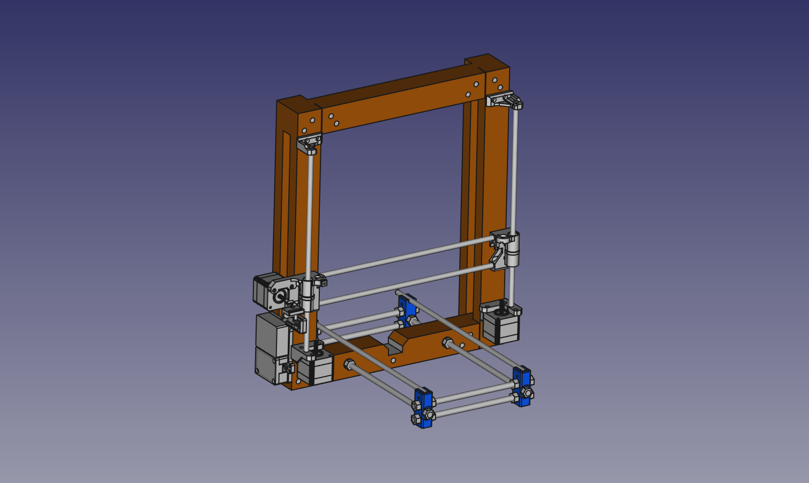

# Luna
Impresora 3D

El actual proyecto corresponde al montaje de una impresora 3D tomando como base una impresora Prusa i3 Rework de codigo abierto, se tratara de documentar el proceso de montado y configuracion, las piezas en su mayoria fueron modificadas por diferentes motivos, estas se compartiran para su uso en abierto, el proceso monteje se puede dividor en los siguientes apartados.

<ol>
  <li>Construir el marco</li>
  <li>cortado de varillas</li>
  <li>impresion de piezas</li>
  <li>calibrado de motores (corriente)</li>
  <li>montaje eje X</li>
  <li>montaje del eje X y Z al marco</li>
  <li>montaje de estructura del eje Y</li>
  <li>montaje de estructura del eje Y</li>
  <li>montaje de la caja para la electronica</li>
  <li>cableado de los componentes</li>
  <li>montaje de la cama caliente</li>
  <li>montaja del extrusor</li>
  <li>calibracion de Marlin</li>
  <a href="github.com/WilberthAA/Luna-3D-printer/blob/master/README.md">link text</a>
  <li>pruebas de extrusion</li>
  <li>pruebas con la cama caliente</li>
  <li>pruebas con la pantalla</li>
  <li>primera impresion</li>
  <li>calibraciones finales</li>
</ol>

